# Terramenta

Rewrite of the JavaFX + NetBeans Terramenta GIS platform
(https://bitbucket.org/teamninjaneer/terramenta/, removed from Bitbucket; a
fork is archived at https://github.com/emxsys/emxsys-terramenta). Different
stack; no feature parity with the original.

Not accepting pull requests while the core feature backlog is in progress.

---

A 3D globe of Earth, written in Rust with [Bevy](https://bevy.org), rendered
via WebGPU, compiled to WebAssembly, and controlled from a JavaScript web app.



*Generated by [`docs/satellites.py`](docs/satellites.py), which propagates the
same orbit classes as the app (crewed stations, a Starlink shell, GPS, Molniya,
and the geostationary ring), rotates them into the Earth-fixed frame, and
renders the result as an animated SVG. Orbital radii are compressed to fit a
geostationary ring and a space station in the same frame; ground tracks, the
terminator, and the far side of each orbit are to scale.*


*Generated by [`terramenta-solare`](terramenta-solare/)'s
[`examples/earth_to_mars.rs`](terramenta-solare/examples/earth_to_mars.rs),
which solves a near-optimal Earth-Mars transfer window with the crate's own
Lambert solver and flies it hour by hour with the same
[`Spacecraft::update`](terramenta-solare/src/spacecraft.rs) call a real
mission clock would make, until it crosses into Mars' sphere of influence and
is captured. The launch and landing flashes and the moving Earth, Mars, and
spacecraft markers are all animated from that same flight data, on a loop.*

## Components

Two independent pairs, each a Rust engine plus the client that drives it:

| | |
| --- | --- |
| **[`terramenta-globe`](terramenta-globe/)** | Earth rendering engine. Draws the Earth, streams OGC imagery, and exposes a control API. Compiles to WebAssembly and to native binaries (Metal, Vulkan, DX12). |
| **[`terramenta-webapp`](terramenta-webapp/)** | Reference client for the globe. Embeds the module and exposes its features through UI controls. |
| **[`terramenta-solare`](terramenta-solare/)** | Mission-planning engine. A frame tree from the Solar System Barycentre down through the Sun, Earth, and Mars, two-body propagation mechanics, and a Lambert solver for transfers between two bodies on two given dates. |
| **[`terramenta-charta`](terramenta-charta/)** | Reference client for `terramenta-solare`. A 2D chart library — including a porkchop plot for interplanetary transfer windows, contoured with its own marching-squares implementation — exposed to JavaScript through the same kind of interface as the globe. |

The engine/client split is consistent across both pairs. `terramenta-globe`
and `terramenta-solare` have no dependency on anything downstream: each
accepts commands, reports state, and computes or renders. Any client — a
dashboard, an analysis tool, this repo's own reference apps — can embed either
module and build its own interface on top; `terramenta-webapp` and
`terramenta-charta` are the worked examples of doing that, one per engine.

## What it does

- **A shaded Earth.** NASA Blue Marble imagery mapped onto a unit sphere, lit
  by a simulated sun. Includes a day/night terminator, city lights on the dark
  side, specular ocean highlights, and a moving cloud layer.
- **An atmosphere.** Additive atmospheric shell, density increasing toward the
  limb, with a twilight arc past the terminator.
- **A sky.** Procedurally generated stars from a hashed 3D cell grid — no pole
  distortion, no texture asset.
- **A real clock.** Clock initializes to current UTC and advances one
  simulated day per four real minutes. Sun position uses a low-precision solar
  model (declination + hour angle), accurate to about 1°.
- **Two reference frames.** ECEF (ground-fixed) and ECI (star-fixed; Earth
  rotates at the sidereal rate). Satellite tracks render per active frame:
  closed ellipses in ECI, corkscrew ground tracks in ECEF.
- **Both of them at once.** Simultaneous display of both frames: inertial
  triad (cyan), Earth-fixed triad and graticule (amber), and the sidereal angle
  between them drawn as an arc. Selecting a satellite renders both its ECI
  orbit ellipse and its ECEF ground track from a single propagation. The
  readout includes rotation as a quaternion and as a DCM, plus both velocity
  vectors — they differ by the transport term `ω × r`.
- **Altitude-aware navigation.** Drag sensitivity scales with camera altitude.
  Ctrl+drag orbits the camera around the current look-at point (heading + tilt
  from nadir to horizon) without shifting that point off-screen. Shift+drag
  rotates the camera in place. Mouse, keyboard, trackpad pinch, and
  multi-touch are all supported.
- **Streaming OGC imagery.** Quadtree tile streaming from any OGC WMS or WMTS
  service, refined on zoom. NASA GIBS layers configured by default.
- **Streaming vector tiles.** Mapbox Vector Tile (MVT) streaming from any
  `{z}/{x}/{y}` endpoint, decoded with
  [`geozero`](https://github.com/georust/geozero), reprojected out of Web
  Mercator, and rendered as screen-space lines, rings, and markers via a
  separate quadtree from the imagery layer (the two projections tile
  differently). Two sources configured by default: MapLibre demo boundaries
  and OpenStreetMap Shortbread tiles.
- **GeoJSON overlays.** Overlay support from a URL or local file: screen-space
  markers, lines, and filled rings. Multiple concurrent layers, each with
  independent colors and refresh interval; per-feature style overrides via
  [simplestyle-spec 1.1.0](https://github.com/mapbox/simplestyle-spec/tree/master/1.1.0).
  Reference app ships three layers by default: a sample with one feature per
  GeoJSON geometry type (including a stepped airspace volume built from rings
  at multiple altitudes), a cube sample, and the USGS earthquake feed
  (refetched every 60s). A fourth sample demonstrates each simplestyle
  property individually.
- **Placement at altitude.** An optional third coordinate element controls
  altitude: markers offset from the surface, lines interpolate height between
  vertices. Altitude scale and clamp-to-surface behavior are configurable per
  layer — the USGS feed clamps to surface since its third element is depth,
  not altitude.
- **Extrusion.** Per-layer extrusion: rings can be walled down to the ground,
  rendering a footprint-at-height as a solid rather than a floating outline.
- **Satellites.** Ephemeris layer sourced from an
  [OMM](https://public.ccsds.org/Pubs/502x0b3e1.pdf) catalogue (successor to
  the TLE), propagated with SGP4 against the simulated clock, rendered as a
  marker with a leading/trailing orbit arc per object. Pausing the clock
  freezes propagation. Draw/trail is toggled per object. Reference app uses
  Celestrak's public catalogue: crewed stations, GPS, the geostationary ring,
  Molniya orbits, and a full Starlink shell. Arc rendering mode is selectable
  per object: ground track (each sample placed against Earth's rotation at its
  timestamp — a corkscrew in ECEF, a figure-eight for nav constellations) or
  orbit path (identical in both frames).
- **Pickable features and satellites.** Cursor hit-testing against overlay
  geometry: the hovered feature is highlighted and its properties listed;
  click to select. Satellites use a separate screen-space pick (pixel distance
  to marker) rather than ground-plane hit-testing, since altitude offset
  breaks ground-plane picking under camera tilt. A pick result includes
  orbital elements, epoch age, and current position.
- **A live readout.** Cursor lat/lon, camera altitude (km), subsolar point,
  and tile streamer status.
- **GeoArrow all the way down.** All vector coordinates — from GeoJSON, from
  vector tiles, or computed per-frame from an orbit — are stored in
  [GeoArrow](https://geoarrow.org) arrays built with the
  [`geoarrow`](https://github.com/geoarrow/geoarrow-rs) crates: contiguous
  `f64` buffers rather than nested `Vec`s. No precision is lost until GPU
  upload, so source precision survives hit-testing and the round trip back
  out. `overlayGeometry(id)` returns a `Float64Array` view into the module's
  own memory (zero-copy), usable from a web worker.
- **All of it under external control.** Layer, imagery, sun, clock, frame,
  camera, and overlay/key-binding state are all controllable from JavaScript;
  the globe streams state changes back.

## Running it

### The web app

```sh
rustup target add wasm32-unknown-unknown
cargo install wasm-bindgen-cli --version 0.2.128   # must match the crate version
cd terramenta-webapp
./scripts/serve.sh                                 # builds if needed, then http://localhost:8080
```

WebGPU requires a secure context; serve over HTTP(S), not `file://`. Supported:
Chrome/Edge 113+, Safari 26+, Firefox 141+ (Linux requires
`dom.webgpu.enabled`).

### The globe on its own, natively

```sh
./terramenta-globe/scripts/fetch-assets.sh
cargo run --release --bin terramenta-globe
```

No web app wrapper; runs the globe standalone with its own overlay and key
bindings. Fastest iteration loop for renderer development.

## Layout

```
Cargo.toml              Workspace: profiles and members
terramenta-globe/       The renderer and its control surface  → its README
terramenta-webapp/      The reference web app                 → its README
terramenta-solare/      Solar-system frame tree and mission mechanics       → its README
terramenta-charta/      2D mission-planning charts, e.g. the porkchop plot → its README
```

`terramenta-webapp` is not a Cargo member — it is HTML, CSS, and ES modules
with no build step beyond compiling the globe module.

## Where to take it next

- Parse `GetCapabilities`/`WMTSCapabilities.xml` to discover a server's
  layers, tile matrix sets, and zoom range instead of hardcoding them.
- Cache tiles to disk or IndexedDB to avoid refetching on revisit.
- Style vector tiles per source layer (e.g., water vs. road network) rather
  than per tile. Features already carry `sourceLayer`; nothing currently uses
  it for styling.
- Decode gzip-encoded vector tiles. Browsers decompress before the bytes reach
  the globe, so the web build handles any service; the native build currently
  reports a `Content-Encoding: gzip` response as an error rather than decoding
  it.
- Add spatial indexing for vector tile feature picking (only overlay features
  are pickable today; the index needs to be built per tile, not per document).
- Move ephemeris propagation off the main thread (web worker or Bevy's task
  pool). It's the one layer computed rather than fetched, and the budgets in
  `ephemeris.rs` exist specifically because propagation currently runs on the
  main thread.
- Add bathymetry/elevation data for normal-mapped terrain relief.
- Pick overlay geometry against its rendered (altitude-offset) position rather
  than the ground plane, so tilted lines and fills are pickable the way
  satellites already are. Harder than point-picking: requires a screen-space
  test against a densified ribbon rather than a point.
- Support property-driven styling for GeoJSON overlays not authored with
  simplestyle — e.g., color earthquake markers by magnitude. Simplestyle
  properties are already honored member-by-member; a mapping from arbitrary
  feed properties to a color ramp or size scale is not implemented.
- Render `marker-symbol` and feature `title`. Both are parsed and carried but
  unused — no icon atlas or label engine exists yet. Currently surfaced only
  via the picked-feature panel.
- Add fly-to / frame-on-feature. `lookAt` exists; nothing calls it from a pick
  event.
- Add click-to-fly. Cursor coordinates are already in the state stream; wiring
  a click to `lookAt` is app-side work only.

## Credits

Base Earth imagery: [NASA Visible Earth](https://visibleearth.nasa.gov) Blue
Marble (public domain). Coastlines in the animation above:
[Natural Earth](https://www.naturalearthdata.com) 110m land (public domain).
Streamed layers: [NASA GIBS](https://nasa-gibs.github.io/gibs-api-docs/).
Vector tiles: [MapLibre demo tiles](https://demotiles.maplibre.org) and
[OpenStreetMap](https://www.openstreetmap.org/copyright) (ODbL). Orbital
elements: [Celestrak](https://celestrak.org), from USSPACECOM's public
catalogue. Propagation: the
[`sgp4`](https://github.com/neuromorphicsystems/sgp4) crate (MIT). Everything
else is MIT OR Apache-2.0.