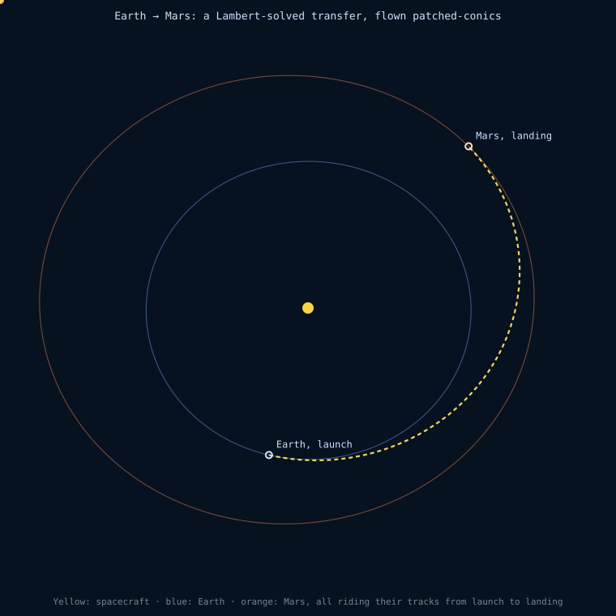
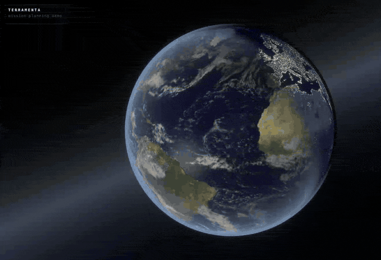

# Terramenta

A 3D Earth globe and solar-system mission-planning toolkit, written in Rust with
[Bevy](https://bevy.org) 0.19, rendered through WebGPU, compiled to WebAssembly,
and driven from a JavaScript web app. The globe also builds as a native binary
(Metal, Vulkan, DX12).

This is a rewrite of the JavaFX + NetBeans Terramenta GIS platform (originally
https://bitbucket.org/teamninjaneer/terramenta/; a fork is archived at
https://github.com/emxsys/emxsys-terramenta). It uses a different stack and does
not aim for feature parity with the original.

Pull requests are not being accepted at this time.



*Generated by [`docs/satellites.py`](docs/satellites.py), which propagates the
same orbit classes the app loads by default (crewed stations, a Starlink shell,
GPS, Molniya, geostationary), rotates them into the Earth-fixed frame, and
renders an animated SVG. Orbital radii are compressed so GEO and LEO fit in one
frame; ground tracks, the terminator, and orbit far sides are to scale.*



*Generated by [`terramenta-solare/examples/earth_to_mars.rs`](terramenta-solare/examples/earth_to_mars.rs):
a near-optimal Earth–Mars transfer solved with the crate's Lambert solver, then
propagated hourly through [`Spacecraft::update`](terramenta-solare/src/spacecraft.rs)
until the spacecraft enters Mars' sphere of influence.*

[](docs/mission-demo.mp4)

*Recorded from [`terramenta-webapp/mission-demo.html`](terramenta-webapp/mission-demo.html)
in Chromium over WebGPU. The page searches for an Earth–Mars launch window,
jumps the clock to departure, follows the spacecraft out of its parking orbit
in the globe view, switches to the heliocentric view after Earth escape, and
stops at Mars capture. White: flown trajectory. Dashed yellow: planned
trajectory. Cruise is time-accelerated. [Full-resolution video](docs/mission-demo.mp4).*

## Components

| Crate / directory | Role |
| --- | --- |
| [`terramenta-globe`](terramenta-globe/) | Rendering engine. Earth globe and heliocentric scene, OGC imagery and MVT streaming, GeoJSON overlays, SGP4 satellites, flown missions. Command/state API exposed to JavaScript via `wasm-bindgen`. |
| [`terramenta-solare`](terramenta-solare/) | Astrodynamics library. Reference-frame tree rooted at the Solar System Barycentre (Sun, Earth, Mars), two-body propagation, Lambert solver, transfer planning, patched-conics spacecraft. Pure Rust, `f64` throughout. |
| [`terramenta-charta`](terramenta-charta/) | 2D mission-planning charts on top of `terramenta-solare`: porkchop grid and marching-squares contouring, exposed to JavaScript as pure functions. |
| [`terramenta-webapp`](terramenta-webapp/) | Reference client. Plain HTML/CSS/ES modules (no bundler) embedding the globe and charta modules. Two pages: the full control panel (`index.html`) and the mission demo (`mission-demo.html`). |

Dependencies run one way: `terramenta-globe` and `terramenta-charta` depend on
`terramenta-solare`; the webapp depends on the compiled WASM modules. Neither
engine depends on the webapp.

## Capabilities

**Earth rendering** (`terramenta-globe`)

- NASA Blue Marble surface on a unit sphere, lit by a custom shader (no Bevy
  PBR lights): day/night terminator, city lights, ocean specular, cloud layer,
  additive atmosphere shell with a twilight arc, procedural starfield.
- Simulated UTC clock, starting at wall-clock time. Default rate 360× (one day
  per four minutes), adjustable 1×–86,400×, forward or backward, pausable.
- Low-precision solar (~1°) and lunar (a few arcminutes) position models;
  subsolar and sublunar points drawn as pickable placemarks.
- ECEF and ECI reference frames, switchable. A GNC overlay draws both at once:
  inertial and Earth-fixed triads, graticule, sidereal-angle arc, and one
  satellite's orbit and ground track from a single propagation. The readout
  reports the ECI→ECEF rotation as a quaternion and both velocities
  (`v_ecef = R3(θ)·(v_eci − ω × r)`).
- Altitude-scaled camera: drag orbits, Ctrl+drag changes heading/tilt about the
  look-at point, Shift+drag rotates in place. Mouse, keyboard, trackpad pinch,
  multi-touch.

**Streaming data**

- WMS (1.1.1, 1.3.0) and WMTS (REST and KVP) imagery on a screen-space-error
  quadtree, with ancestor fallback and request throttling. Eight NASA GIBS
  presets.
- Mapbox Vector Tiles from any `{z}/{x}/{y}` endpoint: decoded with
  [`geozero`](https://github.com/georust/geozero), clipped per tile, unprojected
  from Web Mercator, drawn as pixel-width lines, rings and markers. Presets:
  MapLibre demo boundaries, OpenStreetMap Shortbread.
- GeoJSON overlays from URL or text: multiple layers, per-layer colour,
  visibility and refresh period; third-coordinate altitude with configurable
  scale or clamp-to-surface; ring extrusion to the ground;
  [simplestyle-spec 1.1.0](https://github.com/mapbox/simplestyle-spec/tree/master/1.1.0)
  per-feature styling; antimeridian-aware ear-clipping tessellation.
- Satellite layers from [OMM](https://public.ccsds.org/Pubs/502x0b3e1.pdf) JSON,
  propagated with SGP4 every frame against the simulated clock. Per-object
  selection and orbit trails (ground track or orbit path); bounded by a
  600-object marker cap and a shared trail sample budget.
- Cursor picking for overlay features, satellites and placemarks, with hover
  and pin state reported through the API.
- All vector coordinates stored as `f64` [GeoArrow](https://geoarrow.org)
  arrays; `overlayGeometry(id)` and `ephemerisGeometry(id)` return zero-copy
  `Float64Array` views into WASM memory.

**Mission planning and flight** (`terramenta-solare`, `terramenta-charta`, `terramenta-globe`)

- Frame tree with Sun, Earth and Mars positions from JPL low-precision
  planetary elements (valid 1800–2050); relative states computed at the nearest
  common ancestor in `f64`.
- Lambert solver (Vallado universal-variable formulation), dated transfer
  planning (`plan_transfer`), grid window search (`find_best_transfer_window`),
  and a Hohmann baseline.
- Patched-conics spacecraft that reparents between Earth, Sun and Mars at
  sphere-of-influence crossings without a position discontinuity.
- Porkchop grid (total Δv over departure × arrival date) with marching-squares
  contours, callable from Rust or JavaScript.
- Heliocentric view in the globe: Sun, Earth and Mars as lit spheres with
  exaggerated radii, animated solar surface and corona, a floating origin to
  keep `f32` transforms precise, and an animated transition from the globe view.
- Missions flown in the scene: `addMission` searches for a window, waits for
  the simulated clock to reach departure, launches from a 300 km parking orbit,
  escapes, cruises and is captured. Flown and planned trajectories are drawn;
  the camera can lock onto the spacecraft in both views.

Everything above is controllable through the globe's command API
([`terramenta-globe/src/api.rs`](terramenta-globe/src/api.rs)), and state is
streamed back to a single JavaScript listener at ~10 Hz plus on change.

## Running

### Web app

```sh
rustup target add wasm32-unknown-unknown
cargo install wasm-bindgen-cli --version 0.2.128   # must match the wasm-bindgen crate version
cd terramenta-webapp
./scripts/serve.sh                                 # builds globe + charta modules if needed; http://localhost:8080
```

`index.html` is the full control panel; `mission-demo.html` is the mission
demo. WebGPU requires a secure context, so serve over HTTP(S), not `file://`.
Supported browsers: Chrome/Edge 113+, Safari 26+, Firefox 141+ (Linux requires
`dom.webgpu.enabled`).

### Native globe

```sh
./terramenta-globe/scripts/fetch-assets.sh
cargo run --release --bin terramenta-globe
```

Runs the globe standalone with its built-in HUD and key bindings.

### Examples and tests

```sh
cargo test --workspace
cargo run --example earth_to_mars -p terramenta-solare   # writes terramenta-solare/docs/earth_to_mars.svg
cargo run --example porkchop -p terramenta-charta        # writes terramenta-charta/docs/porkchop.svg
```

## Layout

```
Cargo.toml            Workspace members and build profiles (dev deps at opt-level 3; web-release at opt-level "s")
docs/                 README media and the satellites.svg generator
terramenta-globe/     Renderer and control API
terramenta-solare/    Frame tree and astrodynamics
terramenta-charta/    Porkchop grid and contouring
terramenta-webapp/    Reference web client (not a Cargo member)
```

## Credits

Base Earth imagery: [NASA Visible Earth](https://visibleearth.nasa.gov) Blue
Marble (public domain). Coastlines in `docs/satellites.svg`:
[Natural Earth](https://www.naturalearthdata.com) 110m land (public domain).
Streamed imagery: [NASA GIBS](https://nasa-gibs.github.io/gibs-api-docs/).
Vector tiles: [MapLibre demo tiles](https://demotiles.maplibre.org) and
[OpenStreetMap](https://www.openstreetmap.org/copyright) (ODbL). Orbital
elements: [Celestrak](https://celestrak.org), from USSPACECOM's public
catalogue. Propagation: the [`sgp4`](https://github.com/neuromorphicsystems/sgp4)
crate (MIT). Everything else is MIT OR Apache-2.0.
