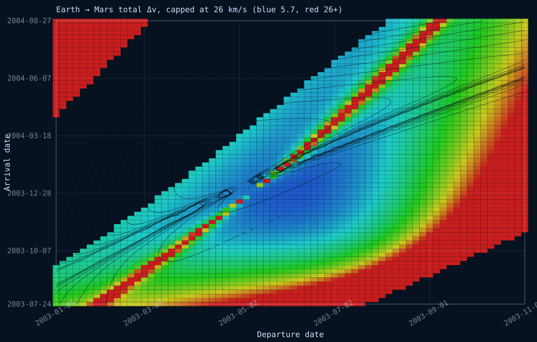

# terramenta-charta

2D mission-planning charts, built on [`terramenta-solare`](../terramenta-solare/)'s
frame tree — starting with the porkchop plot: total delta-v as a contoured
field over departure date against arrival date, which is how an
interplanetary launch window is actually chosen. A Hohmann transfer is always
optimal, for a departure date nobody picked; the cheapest date to leave and
the cheapest date to arrive are a joint choice a real mission has to scan
for, and this crate is that scan.



*Not drawn by hand: [`examples/porkchop.rs`](examples/porkchop.rs) solves
[`terramenta_solare::mission::plan_transfer`](../terramenta-solare/src/mission.rs)
at every one of 70×70 departure/arrival date pairs against the real
planetary ephemeris, traces contour lines through the result with this
crate's own marching-squares implementation, and writes the SVG above. The
colour scale and contour levels are capped 20 km/s over the cheapest transfer
in the window — a cell right along the "arrival before departure" edge is
asking for an almost-instantaneous hop across half an AU, which Lambert
answers with a genuine but enormous delta-v that would otherwise crush the
whole interesting range into a sliver of blue.*

## What it computes

[`grid::porkchop_grid`] runs `plan_transfer` at every point on a departure
date axis crossed with an arrival date axis, both linearly spaced, and
returns a [`grid::PorkchopGrid`]: one cell per pair, holding the transfer's
time of flight and the delta-v needed at each end — or `None` wherever
Lambert had no solution, most commonly because the arrival date sits at or
before the departure date.

[`contour::contours`] traces contour lines through any such field by marching
squares. It is deliberately generic on a plain grid of `Option<f64>` rather
than tied to `PorkchopGrid`, so the departure- or arrival-only half of the
delta-v budget can be contoured on its own if a caller wants that instead. A
grid cell contributes no segment wherever one of its four corners is `None`,
so the unsolved region of a porkchop grid stays a gap in the contours rather
than an invented boundary. Segments come back unstitched — marching squares
finds them one cell at a time with no ordering between cells — which costs
nothing a porkchop plot needs: drawn densely enough, a soup of short strokes
reads as a line just as well as a joined path would.

```rust
use terramenta_charta::{contours, porkchop_grid};
use terramenta_solare::lambert::TransferDirection;
use terramenta_solare::{Epoch, solar_system};

let tree = solar_system();
let (sun, earth, mars) = (
    tree.find("Sun").unwrap(),
    tree.find("Earth").unwrap(),
    tree.find("Mars").unwrap(),
);

let grid = porkchop_grid(
    &tree, sun, earth, mars,
    Epoch::J2000, Epoch::J2000.advanced_by_seconds(300.0 * 86_400.0), 40,
    Epoch::J2000.advanced_by_seconds(150.0 * 86_400.0),
    Epoch::J2000.advanced_by_seconds(600.0 * 86_400.0), 40,
    TransferDirection::Prograde,
);

// Levels have to be chosen from the grid's own range — there is no fixed
// "interesting" delta-v that holds for every body pair and every window.
let (min, max) = grid.total_delta_v_bounds_km_s().unwrap();
let levels: Vec<f64> = (1..=8).map(|i| min + (max - min) * i as f64 / 9.0).collect();

let xs: Vec<f64> = grid.departures.iter().map(|e| e.to_unix_seconds()).collect();
let ys: Vec<f64> = grid.arrivals.iter().map(|e| e.to_unix_seconds()).collect();
let lines = contours(&xs, &ys, &grid.total_delta_v_km_s(), &levels);
```

## The web binding

[`src/wasm.rs`](src/wasm.rs) exposes the same computation to JavaScript as
two functions returning plain JSON — `bodies()` and
`computePorkchopPlot(...)` — the same split `terramenta-globe`'s own
`wasm.rs` makes between the model and the page around it, except there is no
running state to queue commands against or stream a callback out of: a
porkchop plot is a pure function of the dates and bodies asked for, answered
once rather than streamed.

```sh
./scripts/build-wasm.sh --release      # into ./dist
```

`terramenta-webapp` is the reference caller.
[`src/porkchop.js`](../terramenta-webapp/src/porkchop.js) wraps the module,
and [`src/mission.js`](../terramenta-webapp/src/mission.js) is the "Mission"
panel tab that turns it into the picker-and-chart shown above — including
finding sane contour levels in JavaScript: it calls `computePorkchopPlot`
once with no levels, to read the grid's own delta-v range back, then again
with levels spaced across that range, since which levels are worth
contouring can only be chosen after the range is known.

## Regenerating the image

```sh
cargo run --example porkchop -p terramenta-charta
```

Writes `docs/porkchop.svg` in place, from a fixed Earth-Mars window around
the near-optimal transfer this crate's own tests use. There is no plotting
library underneath either the example or `mission.js` — both write SVG
elements by hand from the grid and its contours.
