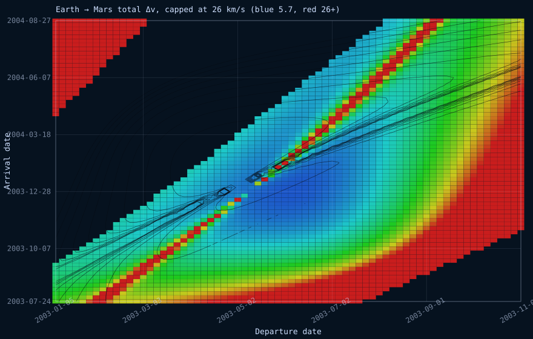

# terramenta-charta

2D mission-planning charts built on [`terramenta-solare`](../terramenta-solare/).
Currently provides the porkchop plot: total transfer Δv as a contoured field
over departure date × arrival date. Compiles to a native `rlib` and to a WASM
`cdylib` for [`terramenta-webapp`](../terramenta-webapp/).



*Generated by [`examples/porkchop.rs`](examples/porkchop.rs): 70×70 calls to
[`plan_transfer`](../terramenta-solare/src/mission.rs) against the planetary
ephemeris, contoured with this crate's marching squares. Colour scale and
contour levels are capped at the window minimum + 20 km/s, since cells near the
arrival-before-departure edge have valid but very large Lambert Δv.*

## API

- **[`grid::porkchop_grid`](src/grid.rs)** evaluates `plan_transfer` over
  linearly spaced departure and arrival axes and returns a `PorkchopGrid`. Each
  cell holds time of flight and departure/arrival Δv, or `None` where Lambert
  has no solution (typically arrival ≤ departure).
  `total_delta_v_bounds_km_s()` returns the min/max; `total_delta_v_km_s()`
  returns the field for contouring.
- **[`contour::contours`](src/contour.rs)** runs marching squares on any
  `Option<f64>` grid. Cells with a `None` corner emit no segments, so unsolved
  regions remain gaps. Segments are returned unstitched, one set per level.

```rust
use terramenta_charta::{contours, porkchop_grid};
use terramenta_solare::lambert::TransferDirection;
use terramenta_solare::{Epoch, solar_system};

let tree = solar_system();
let (sun, earth, mars) = (
    tree.find("Sun").unwrap(),
    tree.find("Earth").unwrap(),
    tree.find("Mars").unwrap(),
);

let grid = porkchop_grid(
    &tree, sun, earth, mars,
    Epoch::J2000, Epoch::J2000.advanced_by_seconds(300.0 * 86_400.0), 40,
    Epoch::J2000.advanced_by_seconds(150.0 * 86_400.0),
    Epoch::J2000.advanced_by_seconds(600.0 * 86_400.0), 40,
    TransferDirection::Prograde,
);

// Choose levels from the grid's own range.
let (min, max) = grid.total_delta_v_bounds_km_s().unwrap();
let levels: Vec<f64> = (1..=8).map(|i| min + (max - min) * i as f64 / 9.0).collect();

let xs: Vec<f64> = grid.departures.iter().map(|e| e.to_unix_seconds()).collect();
let ys: Vec<f64> = grid.arrivals.iter().map(|e| e.to_unix_seconds()).collect();
let lines = contours(&xs, &ys, &grid.total_delta_v_km_s(), &levels);
```

## WebAssembly binding

[`src/wasm.rs`](src/wasm.rs) exports two stateless functions returning JSON:

- `bodies()` — body names accepted as origin/destination.
- `computePorkchopPlot(origin, destination, depStart, depEnd, depSteps,
  arrStart, arrEnd, arrSteps, contourLevelsKmS, retrograde)` — dates in Unix
  seconds. Returns `{departuresUnixSeconds, arrivalsUnixSeconds, cells,
  totalDeltaVBoundsKmS, contours: [{value, segments}]}`, with `cells`
  departure-major and `null` for unsolved pairs. Pass `[]` for
  `contourLevelsKmS` to skip contouring. Returns `null` for an unknown body or
  fewer than 2 steps on either axis.

```sh
./scripts/build-wasm.sh --release      # into ./dist
```

The webapp wraps the module in [`porkchop.js`](../terramenta-webapp/src/porkchop.js)
and renders it in the Mission tab ([`mission.js`](../terramenta-webapp/src/mission.js)).
It calls `computePorkchopPlot` once with no levels to read the Δv bounds, then
again with levels spaced across that range.

## Regenerating the image

```sh
cargo run --example porkchop -p terramenta-charta
```

Writes `docs/porkchop.svg` for a fixed Earth–Mars window around the
near-optimal transfer used in the tests. SVG is written directly, without a
plotting library.
